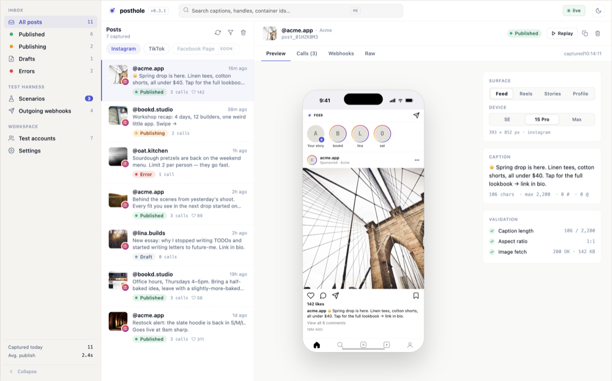

# posthole

[](https://www.repostatus.org/#wip)
[](https://github.com/socialpyre/posthole/actions/workflows/ci.yml)

> [!WARNING]
> **Pre-release / alpha.** APIs and UI may break without notice.
> Not yet recommended for any production use.

**Local mock server for social media platform APIs - auth, publishing, the lot.**

posthole is a developer tool that stands in for real social media platform APIs so
you can build and test integrations end-to-end on your laptop. Run it next to your
app, point your code at `127.0.0.1:5176` instead of the real provider, and an
inbox-style UI shows every post you've published alongside the complete HTTP
transcript of each call. Instagram is the first platform supported; TikTok,
Facebook, and others are on the roadmap.



It mocks the parts of these APIs you actually need while developing:

- **OAuth flows** — authorize dialogs, token exchange, and token refresh.
- **Content publishing** — images, videos, reels, stories, and carousels
  (including mixed-media), modeled on the real multi-step
  container → poll → publish lifecycle.
- **Accounts and permissions** — switch between seeded test accounts and
  simulate revoked permissions.
- **Per-endpoint behavior toggles** — flip any endpoint into a failure mode at
  runtime: rate-limited, validation error, media URL unreachable, reel
  duration too long, expired token, async-finished-with-error, slow response.
- **Scenarios** — named bundles of behaviors (Validation, Quota, Auth, Async,
  Latency) so a single switch flips a whole class of failures on at once and
  you can watch how your code copes.

On the roadmap: **replay** (re-drive a captured request chain under a different
scenario without re-running your app), **inject** (seed posts manually to
reproduce specific UI states), more platforms (TikTok, Facebook, then YouTube
and Threads), and richer device-preview frames.

## Quick start

**Docker (recommended):**

```bash
docker run --rm -p 5176:5176 ghcr.io/socialpyre/posthole:latest
# → http://127.0.0.1:5176
```

**As a uv tool (once published to PyPI):**

```bash
uvx posthole
# → http://127.0.0.1:5176
```

## Getting started

### Prerequisites

- **Python 3.12+**
- [**uv**](https://docs.astral.sh/uv/) ≥ 0.11 — `curl -LsSf https://astral.sh/uv/install.sh | sh`
- **Node 22** + **pnpm 11** — `nvm use` (reads `.nvmrc`) then `corepack enable`
- **Docker** (optional, only if you want to run the containerized image or test it locally)

### Clone, install, run

```bash
git clone https://github.com/socialpyre/posthole
cd posthole
make install            # uv sync + pnpm install
make dev                # server + asset watchers + browser auto-reload
```

Then open <http://127.0.0.1:5176>.

Configurable knobs live in [`.env.schema`](./.env.schema); copy to `.env.local`
to override locally. See [CONTRIBUTING.md](./CONTRIBUTING.md#configuration) for
the workflow.

### Common make targets

| Command           | What it does                                                           |
| ----------------- | ---------------------------------------------------------------------- |
| `make help`       | Show available targets                                                 |
| `make install`    | Sync Python (`uv sync`) + Node (`pnpm install`) deps                   |
| `make dev`        | Run FastAPI server + esbuild + Tailwind watchers + browser auto-reload |
| `make run`        | Run the FastAPI server only (no watchers), with varlock-injected env   |
| `make assets`     | One-shot rebuild of `app.js` + `app.css`                               |
| `make test`       | Run pytest + vitest                                                    |
| `make lint`       | `ruff check` + `ruff format --check` + `prettier --check`              |
| `make format`     | `ruff format` + `ruff check --fix` + `prettier --write`                |
| `make typecheck`  | `ty check` (Python) + `tsc --noEmit` (TypeScript)                      |
| `make check`      | Everything CI runs (lint + typecheck + test)                           |
| `make build`      | Build wheel + sdist into `dist/`                                       |
| `make docker`     | Build the Docker image locally as `posthole:dev`                       |
| `make docker-run` | Run the locally built image                                            |

### Live reload

`make dev` runs the processes declared in [`Procfile.dev`](./Procfile.dev) under
[`honcho`](https://honcho.readthedocs.io/), so a single Ctrl-C tears them all
down:

- **`fastapi dev`** restarts the server on `.py` / `.toml` edits via `watchfiles`.
- **esbuild `--watch`** rebuilds `src/posthole/static/app.js` on `.ts` edits.
- **`tailwindcss --watch`** rebuilds `src/posthole/static/app.css` on template / CSS edits.
- [`arel`](https://pypi.org/project/arel/) is mounted on `/hot-reload` (gated by
  `POSTHOLE_DEV_RELOAD=1`) and reloads the browser when watched files change.

See [CONTRIBUTING.md](./CONTRIBUTING.md) for the full development workflow,
commit conventions, and release process.

## License

MIT — see [LICENSE](./LICENSE).
